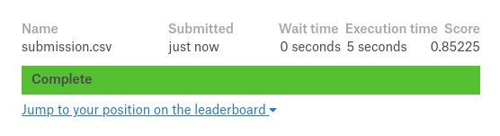
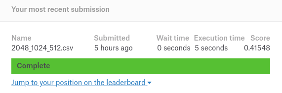

[KAGGLE] Airbnb New User Bookings 
==============================

predict in which country a new user will make his or her first booking.

Results
------------
- Random Forests
    - 85.2% Accuracy Kaggle Tests

- Neural Network
    - 40% Accuracy Kaggle Tests
    - 60% Accuracy Local Tests

How to use
------------
- install requirements
`pip install -r requirements.txt`

- generate data
`python -m src.data.data_clean && python -m src.data.data_transform`

- use NN model
`python -m src.models.train_model`

- use Random Forests model
`python -m src.models.decision_tree`

Project Organization
------------

    ├── data
    │   ├── processed      <- The final, canonical data sets for modeling.
    │   ├── interim        <- Intermediate data that has been transformed.
    │   └── raw            <- The original, immutable data dump.
    │
    ├── models             <- Trained and serialized models, model predictions, or model summaries
    │
    ├── notebooks          <- Jupyter notebooks. Naming convention is a number (for ordering),
    │                         the creator's initials, and a short `-` delimited description, e.g.
    │                         `1.0-jqp-initial-data-exploration`.
    │
    ├── requirements.txt   <- The requirements file for reproducing the analysis environment, e.g.
    │                         generated with `pip freeze > requirements.txt`
    │
    └── src                <- Source code for use in this project.
        │
        ├── data           <- Scripts to download or generate data
        │   └── make_dataset.py
        │
        └── models         <- Scripts to train models and then use trained models to make
            │                 predictions
            ├── decision_tree.py RANDOM FORESTS MODEL
            └── train_model.py   NEURAL NETWORK MODEL
         

--------

<small>Project based on the <a target="_blank" href="https://drivendata.github.io/cookiecutter-data-science/">cookiecutter data science project template</a>. #cookiecutterdatascience</small>

